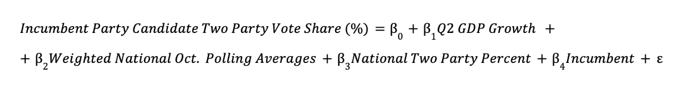

## Introduction

This week, I present my final prediction models for the national
two-party popular vote and the Electoral College for the 2024
presidential election. My final prediction models are multivariate
ordinary least squares (OLS) regression models using national and
state-level data from 1968-2020 to then predict for 2024. I predict that
Vice President Kamala Harris will win the 2024 presidential election,
earning **51.96%** of the national popular vote and carrying the
Electoral College with **319 electoral votes**.

```{r setup, include=FALSE}
# hide code
knitr::opts_chunk$set(echo = FALSE, warning = FALSE, message = FALSE, error = FALSE)

# import libraries
library(car)
library(caret)
library(CVXR)
library(glmnet)
library(tidyverse)
library(patchwork)
library(knitr)
library(sjPlot)
library(kableExtra)
library(maps)
library(readr)
library(stringr)
library(readxl)
library(scales)
library(ggpubr)
library(tigris)
library(sf)
library(tools)

# import data
d_pollav_nat <- read_csv("national_polls_1968-2024.csv")
d_pollav_state <- read_csv("state_polls_1968-2024.csv")
fred_econ <- read_csv("fred_econ.csv") |>
  filter(quarter == 2)
d_pv <- read_csv("popvote_1948_2020.csv")
  d_pv$party[d_pv$party == "democrat"] <- "DEM"
  d_pv$party[d_pv$party == "republican"] <- "REP"
d_state_pv <- read_csv("state_popvote_1948_2020.csv")
  d_state_pv <- d_state_pv |>
    select(year, state, D_pv2p, D_pv2p_lag1)
states <- map_data("state") |>
  rename(state = region)
states$state <- str_to_title(states$state)
ec <- read_csv("corrected_ec_1948_2024.csv") 
  ec <- ec |>
    filter(year == 2024)
expert_24 <- read_excel("expert_2024.xlsx")
national_party_id <- read_csv("national_party_id.csv") 
  national_party_id$party[national_party_id$party == "democrat"] <- "DEM"
  national_party_id$party[national_party_id$party == "republican"] <- "REP"

state_abb_xwalk <- d_state_pv |>
  mutate(state_abb = state.abb[match(d_state_pv$state, state.name)]) |> 
  select(state, state_abb) |> 
  distinct() 
state_abb_xwalk[51,]$state <- "District of Columbia"
state_abb_xwalk[51,]$state_abb <- "DC"
```

## The National Two-Party Popular Vote Model

First, I created a multivariate OLS regression model to predict the
national two-party popular vote.

Here is the equation for the national model. 

In this model, the dependent variable is the incumbent party candidate's
share of the national two-party popular vote (%). The incumbent party is
the party of the sitting president during the presidential election
year.

The independent variables consist of the following:

1.  **Q2 GDP Quarterly Growth**: the national GDP growth (%) for Quarter
    2 of a presidential election year
2.  **Weighted National October Polling Averages**: the average of
    national October horse-race polls, sourced from
    [538](https://projects.fivethirtyeight.com/polls/) and weighted by
    weeks left before the election
3.  **National Two-Party Percentage**: the national two-party percentage
    of party affiliation, sourced from
    [Gallup](https://news.gallup.com/poll/15370/party-affiliation.aspx)
    and [Pew Research
    Center](https://www.pewresearch.org/politics/2024/04/09/the-partisanship-and-ideology-of-american-voters/)
4.  **Incumbent Status**: whether the incumbent party candidate is also
    the incumbent president (1) or not (0)

### National Model Justification

For Q2 GDP growth, I draw on [Achen and Bartels
(2014)](https://press.princeton.edu/books/hardcover/9780691169446/democracy-for-realists?srsltid=AfmBOorl6iN4qgweThT5hVNygA3GYiEx8IZYUksJEgexdWLE3Es2imza),
who examine the role of "economic voting" in predicting voter behavior
in their book *Democracy for Realists*. They note that economic distress
can be politically damaging to incumbents as voters attribute economic
downturns to the incumbent and subsequently vote "by their pocketbooks."
Furthermore, Achen and Bartels note that voters have relatively short
time horizons: they tend to focus on economic growth in a presidential
election year, rather than evaluating the entirety of the incumbent's
term. Although their analysis mainly focuses on income growth, real
disposable personal income (RDPI) growth was not statistically
significant and reduced the R-squared values when I included it in
previous versions of my prediction model. As such, I utilize GDP growth
from Quarter 2 (Q2) of an election year in my model: Q2 is the period of
April through June, which provides a stable but recent snapshot of the
pre-election national economy.

For national October polling averages, I look to [Gelman and King
(1993)](https://gking.harvard.edu/files/bj215.pdf), who found that the
number of days before an election matters for poll accuracy. Their
article discuss how early polls present "fairly miserable forecasts" of
election outcomes, although polls eventually converge to actual
electoral results "shortly before Election Day." To address this
finding, I include national polling averages on the general election for
the month of October weighted by weeks left before the election; this
adjustment accounts for the idea that polls taken closer to Election Day
tend to be more predictive of voter behavior.

For national two-party percentage, I reference [Kim and Zilinsky
(2024)](https://link.springer.com/article/10.1007/s11109-022-09816-z).
Among a mix of demographic variables (e.g. race, gender, age,
education), they conclude that partisan identification is the strongest
predictor of the national two-party vote share. I therefore include the
national two-party percentages of party affiliation in my model.

For incumbent status, incumbent politicians are often understood to have
a structural [“advantage”](https://www.jstor.org/stable/448401) over
their challengers: they can harness the “bully pulpit” to command media
attention and shape public opinion, get a head start on campaigning, and
utilize the powers of their offices (e.g., control spending) to gain
constituent favor. However, [Brown
(2014)](https://www.cambridge.org/core/journals/journal-of-experimental-political-science/article/voters-dont-care-much-about-incumbency/ECFE39E003912F8AF65C2AD14A34BD8C)
finds that voters do not significantly respond to incumbency status when
structural advantages — such as advertising, credit claiming and
position-taking — are held constant. That being said, I still believe
that it is important to account for incumbency in my model: I utilize a
numeric variable that is equal to 1 if the incumbent party candidate is
also the incumbent president and 0 if not.

### National Model Regression Table

I train my model on data from 1968 to 2016, which covers 13 presidential
elections. Notably, I exclude 2020, which is a significant economic
outlier because of the unprecedented [economic
turmoil](https://www.brookings.edu/articles/ten-facts-about-covid-19-and-the-u-s-economy/)
from the COVID-19 pandemic.

The regression table for my final national two-party popular vote
predictive model follows.

```{r national model}
# national poll data
nat_poll <- d_pollav_nat |>
  select(year, state, weeks_left, poll_date, poll_support, party) |>
  filter(month(poll_date) == 10) |>
  group_by(year, party, month = month(poll_date)) |>
  summarize(poll_support = round(weighted.mean(poll_support, weeks_left, na.rm = TRUE), 2), .groups = "drop") |>
  pivot_wider(names_from = month, 
              values_from = poll_support, 
              names_prefix = "month_") |>
  drop_na() |>
  rename(oct_poll = month_10)

# build national model
nat_model <- d_pv |> 
  left_join(fred_econ, by = "year") |> 
  filter(year >= 1968, 
         incumbent_party) |>
  mutate(incumbent = as.numeric(incumbent)) |>
  left_join(nat_poll, by = c("year", "party")) |>
  left_join(national_party_id, by = c("year", "party"))

# table 1: national model
nat_reg <- lm(pv2p ~ GDP_growth_quarterly + oct_poll + two_party_percent + incumbent, 
              data = subset(nat_model, year < 2020))

tab_model(nat_reg, show.se = TRUE, 
          title = "Regression Table for National Model (1968-2016)", 
          dv.labels = "National Popular Vote Share for Incumbent Party Candidate")
```

### Interpretation of Coefficients

All coefficients are statistically significant except for two-party
percent and incumbent at the 99% confidence level.

1.  **Q2 GDP Quarterly Growth**: For every percent increase in Q2 GDP
    growth, there is a 0.50% point increase in the incumbent party
    candidate's national two-party popular vote share. This coefficient
    is statistically significant (p = 0.007), showing a positive
    relationship between GDP growth and popular vote share.
2.  **Weighted National October Polling Averages**: For every percent
    increase in the October polling average, there is a 0.47% point
    increase in the incumbent party candidate's national two-party
    popular vote share. This coefficient is statistically significant (p
    \< 0.001), which indicates that October polling averages are also a
    strong predictor of national popular vote share.
3.  **National Two-Party Percentage**: For every percent increase in the
    national two-party percent, there is a 0.12% point increase in the
    incumbent party candidate's national two-party popular vote share.
    This coefficient is not statistically significant (p = 0.093) at
    this confidence interval.
4.  **Incumbent Status**: For every percent increase in incumbency
    status, there is a 1.13% point increase in the incumbent party
    candidate's national two-party popular vote share. This coefficient
    is not statistically significant (p = 0.327) at this confidence
    interval.

Although both two-party percentage and incumbent status are not
statistically significant predictors in this model, they are often
theoretically important to election outcomes as previously discussed.
Including these variables helps avoid omitted variable bias and enhances
the model's R-squared value, reflecting a more comprehensive
understanding of factors that influence electoral results.

### National Model Validation

In terms of in-sample error, an R-squared value of 0.92 means that 92%
of the variation in national two-party popular vote share is accounted
for by the model's predictors. This suggests a strong correlation
between the model's variables and presidential election outcomes.

The adjusted R-squared of 0.88 corrects for the number of predictors in
the model, ensuring that the fit is not overstated owing to unnecessary
or insignificant variables. The small drop between R-squared and
adjusted R-squared indicates that the model does not significantly
suffer significantly from over-fitting, which means that the included
variables are relevant and contribute to the model's predictive power.

To evaluate out-of-sample fit, I conducted 1,000 iterations of
cross-validation, each time randomly selecting half of the election
years — or six elections — to serve as the test set. The model’s mean
absolute out-of-sample residual across these runs is approximately 3.63,
which indicates a strong predictive fit when considering that the
national two-party vote share spans nearly 20 percentage points. In
other words, the model can predict outcomes within a relatively close
range of actual electoral results on average. The following histogram
displays the distribution of out-of-sample errors for the national model
with a red dashed line for the mean absolute out-of-sample error.

```{r national model out-of-sample fit, fig.width=10, fig.height=6}
# set seed
set.seed(02171)

# run cross-validation
out_samp_errors <- sapply(1:1000, function(i) {
  years_out_samp <- sample(nat_model$year, 6)
  mod <- lm(pv2p ~ GDP_growth_quarterly + oct_poll + two_party_percent + incumbent, 
            data = nat_model[!(nat_model$year %in% years_out_samp), ])
  out_samp_pred <- predict(mod, newdata = nat_model[nat_model$year %in% years_out_samp, ])
  if (any(is.na(out_samp_pred)) || any(is.na(nat_model$pv2p[nat_model$year %in% years_out_samp]))) {
    return(NA)
  }
  
  out_samp_truth <- nat_model$pv2p[nat_model$year %in% years_out_samp]
  mean(abs(out_samp_pred - out_samp_truth))
})

out_samp_errors <- na.omit(out_samp_errors)
mean_out_samp_error <- mean(out_samp_errors)

# figure 1: natioanl model out-of-sample errors from cross validation
ggplot() +
  geom_histogram(mapping = aes(x = out_samp_errors), fill = "#D3D3D3", binwidth = 0.5) + 
  geom_vline(aes(xintercept = mean_out_samp_error), color = "firebrick", linetype = "dashed", size = 1) + 
  labs(title = "National Model Out-of-Sample Errors from Cross-Validation",
       x = "Out-of-Sample Mean Absolute Errors",
       y = "Count") +
  theme_minimal() +
  theme(
    plot.title = element_text(hjust = 0.5, face = "bold", size = 14, vjust = 2)
  )
```

The errors appear slightly right-skewed, indicating the model
occasionally underestimates the incumbent party candidate's performance
by a wider margin than it overestimates. This histogram shows a small
number of outliers on the far right of the distribution, where the
out-of-sample mean absolute errors exceed 5. These outliers indicate
instances where the model made unusually large prediction errors,
underestimating the incumbent party candidate's performance relative to
other cases.

However, the right skew in the error distribution is not necessarily a
negative. Predictive models often reflect the unpredictable nature of
elections, where certain factors may cause the incumbent party candidate
to outperform expectations in specific years. Overall, the model
performs relatively well, and these validity assessments demonstrate its
robustness in forecasting electoral outcomes.

## Predictions for 2024 National Two-Party Popular Vote

Using the national model, I predict the national two-party popular vote
share for the incumbent party candidate — Vice President Harris — in the
2024 presidential election.

```{r national prediction table}
# national 2024 data
nat_pred_data <- nat_model |>
  filter(year == 2024) |>
  select(GDP_growth_quarterly, oct_poll, two_party_percent) |>
  mutate(incumbent = 0)

# 2024 prediction
nat_pred <- predict(nat_reg, nat_pred_data, interval = "prediction")
nat_pred <- round(nat_pred, 2)
 
# table 2: national model prediction
knitr::kable(nat_pred, 
             col.names = c("Prediction", "Lower Bound", "Upper Bound")) |>
  kableExtra::kable_styling(full_width = FALSE)
```

The national model predicts that Vice President Harris will win
**51.96%** of the national two-party popular vote. This means that
former President Donald Trump is expected to capture **48.04%** of the
national two-party popular vote.

The prediction intervals are calculated at the 95% confidence interval.
At the lower bound, I predict that former President Trump will win
52.54% of the national two-party popular vote with Vice President Harris
winning 47.46%. At the upper bound, I predict that Vice President Harris
will win 56.47% of the national two-party popular vote with former
President Trump winning 43.53%.

Finally, I summarize my prediction for the national two-party popular
vote in the following visualization. The dashed black line indicates 50%
of the national two-party popular vote.

```{r national prediction viz, fig.width=10, fig.height=3}
harris_share <- nat_pred[1, 1]
trump_share <- 100 - harris_share

pv_table <- data.frame(
  candidate = c("Kamala Harris", "Donald Trump"),
  pv2p = c(harris_share, trump_share))

# figure 2: national model prediction 
ggplot(pv_table, aes(x = "", y = pv2p, fill = candidate)) +
  geom_bar(stat = "identity", width = 0.3) + 
  geom_hline(yintercept = 50, linetype = "dashed", color = "black", size = 1) + 
  geom_text(aes(label = paste0(pv2p, "%")), position = position_stack(vjust = 0.5), color = "white") + 
  scale_fill_manual(values = c("Kamala Harris" = "dodgerblue3", "Donald Trump" = "firebrick3")) +  
  labs(title = "Predicted National Two-Party Popular Vote Share",
       x = NULL,
       y = NULL, 
       fill = "Candidate") +
  theme_minimal() + 
  theme(
    axis.text.x = element_blank(),  
    axis.ticks.x = element_blank(),
    panel.grid.major.y = element_blank(),  
    panel.grid.minor.y = element_blank(),  
    panel.grid.major.x = element_blank(),  
    panel.grid.minor.x = element_blank(),  
    plot.title = element_text(hjust = 0.5, face = "bold", size = 14, vjust = 2),  
    plot.margin = margin(10, 10, 10, 10) 
  ) +
  coord_flip() +  
  ylim(0, 100) + 
  theme(aspect.ratio = 0.4) +
  geom_label(aes(x = 1, y = 50, label = "50%"), color = "black", fill = "white", vjust = 4, size = 4, label.size = 0.5)

```

## The State-Level Popular Vote & Electoral College Model

Using a similar methodology to the national model, I also created a
multivariate OLS regression model to predict the races of 13 selected
states — informing a prediction for the Electoral College.

Here is the equation for the state model. 

In this model, the dependent variable is the Democratic party
candidate's share of the state-level popular vote (%).

The independent variables consist of the following:

1.  **Democratic Candidate Lag Two-Party Vote Share**: the state-level
    two-party vote share for the Democratic candidate from the previous
    presidential election
2.  **Weighted State-Level October Polling Averages**: the average of
    state-level October horse-race polls, sourced from
    [538](https://projects.fivethirtyeight.com/polls/) and weighted by
    weeks left before the election
3.  **Incumbent Party Status**: whether the Democratic candidate is also
    the incumbent party candidate (1) or not (0)

### State Model Justification

I previously explained the inclusion of polling averages and incumbent
status in my predictive models under the justification of the national
model. Of note, however, is that the incumbency advantage is expressed
here as incumbent party, rather than incumbent president. I wanted to
explore a different measure of incumbency in my state-level model;
incumbent politicians often perform well in elections, though this
advantage does not necessarily extend to their parties. Only 4 incumbent
presidents have lost re-election in the post-war era, while the
incumbent party candidate has only prevailed in 9 out of the 19 last
presidential elections.

Secondly, I add a coefficient to represent the Democratic candidate's
lag popular vote: with increasing political
[calcification](https://www.cookpolitical.com/analysis/national/national-politics/calcified-politics-gives-us-another-close-election),
it is more likely that partisan support among voters will remain
consistent from year to year as individuals vote in line with their
party identities. Therefore, lagged popular vote from the prior election
could potentially be a good predictor of election outcomes.

### State Model Regression Table

I train my model on data from 2000 to 2020 to better reflect modern
voter demographics, polling methodologies, and partisan alignments.

The regression table for my final state-level popular vote predictive
model follows.

```{r state model}
# build state model
state_model <- d_pollav_state |>
  select(year, state, weeks_left, poll_date, poll_support, party) |>
  filter(month(poll_date) == 10,
         party == "DEM", 
         year >= 2000) |>
  group_by(year, state, month = month(poll_date)) |>
  summarize(poll_support = round(weighted.mean(poll_support, weeks_left, na.rm = TRUE), 2), .groups = "drop") |>
  pivot_wider(names_from = month, 
              values_from = poll_support, 
              names_prefix = "month_") |>
  left_join(d_state_pv, by = c("year", "state")) |>
  select(year, state, month_10, D_pv2p, D_pv2p_lag1) |>
  drop_na() |>
  rename(oct_poll = month_10, 
         lag_pv2p = D_pv2p_lag1) |>
  left_join(d_pv |>
  select(year, party, incumbent_party) |>
  filter(party == "DEM") |>
  mutate(incumbent_party = if_else(incumbent_party == "TRUE", 1, 0)) |>
  select(-party), by = "year")

# table 3: state model
state_reg <- lm(D_pv2p ~ lag_pv2p + oct_poll + incumbent_party, 
                data = subset(state_model, year <= 2020))

tab_model(state_reg, show.se = TRUE, 
          title = "Regression Table for State Model (2000-2020)", 
          dv.labels = "Democrat's State-Level Popular Vote Share")
```

### Interpretation of Coefficients

All coefficients except incumbent party status are statistically
significant at the 99% confidence level.

1.  **Democratic Candidate Lag Two-Party Vote Share**: For every percent
    increase in the lagged two-party popular vote, there is a 0.45%
    point increase in the Democratic candidate's state-level two-party
    popular vote share. This coefficient is statistically significant (p
    \< 0.001), which indicates that lagged two-party popular vote is a
    strong predictor of state-level popular vote share.
2.  **Weighted State-Level October Polling Averages**: For every percent
    increase in the state-level October polling average, there is a
    0.67% point increase in the Democratic candidate's state-level
    two-party popular vote share. This coefficient is statistically
    significant (p \< 0.001), which indicates that October polling
    averages are also a strong predictor of state-level popular vote
    share.
3.  **Incumbent Party Status**: For every percent increase in incumbent
    party status, there is a 0.74% point decrease in the Democratic
    candidate's state-level two-party popular vote share. This
    coefficient is not statistically significant (p = 0.092) at this
    confidence interval.

### State Model Validation

In terms of in-sample error, an R-squared value of 0.93 means that 93%
of the variation in state-level two-party popular vote share is
accounted for by the model's predictors. This suggests a strong
correlation between the model's variables and presidential election
outcomes.

The adjusted R-squared value of 0.93 accounts for the number of
predictors in the model. The minimal drop from the R-squared of 0.928 to
the adjusted R-squared of 0.927 suggests the absence of significant
over-fitting, further indicating that the selected predictors contribute
meaningfully to explaining the variation in state-level two-party vote
share for the Democratic candidate.

Likewise, I performed 1,000 iterations of cross-validation to evaluate
the out-of-sample fit, randomly selecting half of the election years —
or 3 elections — for the test set in each iteration. The model’s average
absolute out-of-sample residual across these iterations is approximately
2.8, suggesting a strong predictive capability, especially considering
that the state-level two-party vote share varies by more than 20
percentage points. This means that on average, the model is able to
predict outcomes within a narrow range of actual electoral results. The
following histogram displays the distribution of out-of-sample errors
for the state model with a red dashed line for the mean absolute
out-of-sample error.

```{r state model out-of-sample fit, fig.width=10, fig.height=6}
# set seed
set.seed(02171)

# run cross-validation
out_samp_errors_2 <- sapply(1:1000, function(i) {
  years_out_samp_2 <- sample(state_model$year, 3)
  mod_2 <- lm(D_pv2p ~ lag_pv2p + oct_poll + incumbent_party, 
            data = state_model[!(state_model$year %in% years_out_samp_2), ])
  out_samp_pred_2 <- predict(mod_2, newdata = state_model[state_model$year %in% years_out_samp_2, ])
  if (any(is.na(out_samp_pred_2)) || any(is.na(state_model$D_pv2p[state_model$year %in% years_out_samp_2]))) {
    return(NA)
  }
  
  out_samp_truth_2 <- state_model$D_pv2p[state_model$year %in% years_out_samp_2]
  mean(abs(out_samp_pred_2 - out_samp_truth_2))
})

out_samp_errors_2 <- na.omit(out_samp_errors_2)
mean_out_samp_error_2 <- mean(out_samp_errors_2)

# figure 3: state model out-of-sample errors from cross validation
ggplot() +
  geom_histogram(mapping = aes(x = out_samp_errors_2), fill = "#D3D3D3", binwidth = 0.5) + 
  geom_vline(aes(xintercept = mean_out_samp_error_2), color = "firebrick", linetype = "dashed", size = 1) +
  labs(title = "State Model Out-of-Sample Errors from Cross-Validation",
       x = "Out-of-Sample Mean Absolute Errors",
       y = "Count") +
  theme_minimal() +
  theme(
    plot.title = element_text(hjust = 0.5, face = "bold", size = 14, vjust = 2)
  )
```

The histogram of out-of-sample errors shows a distribution centered
around a mean absolute error of approximately 2.8. The distribution is
somewhat symmetric, with most errors falling between roughly 2 and 4.
However, it is not perfectly bell-shaped; there is a noticeable
concentration of errors around the center and a tapering off toward the
edges. This pattern suggests that the model generally performs well,
with relatively low variation in prediction errors, indicating a degree
of reliability in forecasting election outcomes within a predictable
range.

### Predictions for Selected State Races

Using the state model, I predict the state-level two-party popular vote
share for the Democratic party candidate — Vice President Harris — in
the 2024 presidential election. Notably, I predict 13 state races:
Arizona, Florida, Georgia, Michigan, Minnesota, Nevada, New Hampshire,
New Mexico, North Carolina, Pennsylvania, Texas, Virginia, and
Wisconsin. As mentioned in previous blogs, these states have all been
designated as either “Lean/Likely Democrat,” “Lean/Likely Republican,”
or “Toss Up” in the 2024 state-level predictions from [Cook Political
Report](https://www.cookpolitical.com/ratings/presidential-race-ratings)
and [Sabato’s Crystal
Ball](https://centerforpolitics.org/crystalball/2024-president/). I
exclude NE-02 and ME-02 as data on the congressional district level was
difficult to obtain. Assuming that states designated as “Safe/Solid
Democrat” or “Safe/Solid Republican” by these expert models are
confident calls for their respective parties, I look at these 13 states
to try to predict their electoral votes.

The “Winner” column notes the winner of the state — more than 50% —
based on the predicted two-party popular vote share for Vice President
Harris.

```{r state model prediction table}
# state 2024 data
lag_24 <- d_state_pv |>
  filter(year == 2020) |>
  select(state, D_pv2p) |>
  rename(lag_pv2p = D_pv2p) |>
  mutate(year = 2024)

state_pred_data <- d_pollav_state |>
  select(year, state, weeks_left, poll_date, poll_support, party) |>
  filter(month(poll_date) == 10,
         party == "DEM", 
         year == 2024) |>
  group_by(year, state, month = month(poll_date)) |>
  summarize(poll_support = round(weighted.mean(poll_support, weeks_left, na.rm = TRUE), 2), .groups = "drop") |>
  pivot_wider(names_from = month, 
              values_from = poll_support, 
              names_prefix = "month_") |>
  drop_na() |>
  rename(oct_poll = month_10) |>
  mutate(incumbent_party = 0) |>
  left_join(lag_24, by = c("state", "year")) |>
  drop_na()

# 2024 prediction
final_pred <- predict(state_reg, state_pred_data, interval = "prediction")

final_table <- bind_cols(state_pred_data,
  as.data.frame(final_pred) |> rename_with(~paste0("D_", .))) |>
  mutate(D_fit = round(D_fit, 2), 
         D_lwr = round(D_lwr, 2), 
         D_upr = round(D_upr, 2), 
         winner = if_else(D_fit>50, "Harris", "Trump")) |>
  select(-oct_poll, 
         -year, 
         -incumbent_party, 
         -lag_pv2p) |>
  filter(state %in% c("Arizona", "Florida", "Georgia", "Michigan", "Minnesota", "Nevada", "New Hampshire", "New Mexico", "North Carolina", "Pennsylvania", "Texas", "Virginia", "Wisconsin"))

# table 4: state model prediction
knitr::kable(final_table, 
             col.names = c("State", "Prediction", "Lower Bound", "Upper Bound", "Winner")) |>
  kableExtra::kable_styling(full_width = FALSE) |>
  kableExtra::row_spec(row = which(final_table$winner == "Harris"), background = "#D3E5FF") |>
  kableExtra::row_spec(row = which(final_table$winner == "Trump"), background = "#FFD1D1")
```

The state model predicts that Vice President Harris will win Arizona,
Georgia, Michigan, Minnesota, Nevada, New Hampshire, New Mexico, North
Carolina, Pennsylvania, Virginia, and Wisconsin. Former President Trump
is predicted to win Florida and Texas.

I also create a visualization to present the confidence intervals for
these state-level predictions of the Democrat's popular vote share. The
black dot is the predicted Democrat popular vote share, with the blue
dot (favoring Democrats) representing the upper bound and the red dot
(favoring Republicans) representing the lower bound. The darker red
dashed line marks 50% of the state-level popular vote.

```{r state prediction intervals, fig.width=10, fig.height=6}
# figure 4: state prediction intervals
final_table |>
  mutate(state = reorder(state, D_fit)) |>
ggplot(aes(x = D_fit, y = state)) +
  geom_segment(aes(x = D_lwr, xend = D_upr, yend = state), color = "lightgray", size = 2) +  
  geom_point(aes(x = D_fit), color = "black", size = 3) +  
  geom_point(aes(x = D_lwr), color = "firebrick3", size = 3) +  
  geom_point(aes(x = D_upr), color = "dodgerblue3", size = 3) +  
  geom_vline(xintercept = 50, color = "firebrick", linetype = "dashed", size = 1) +
  labs(title = "Predicted Democratic Popular Vote Share with Confidence Intervals by State",
       x = "Predicted Democratic Vote Share (%)",
       y = "State") +
  theme_minimal() +
  scale_x_continuous(breaks = seq(40, 60, by = 5)) +
  theme(plot.title = element_text(hjust = 0.5, face = "bold", size = 14))
```

As evident by this plot, many of these state races are contested and the
lower bounds of the prediction intervals cross 50%. This demonstrates
the close nature of the upcoming election, particularly in the 7 key
[battleground
states](https://www.nytimes.com/interactive/2024/us/elections/presidential-election-swing-states.html).

### Predicted Electoral College Results for 2024 Presidential Election

Lastly, I designate the winners of the 37 remaining states according to
the expert models previously cited. My result is the following predicted
Electoral College map for the 2024 presidential election.

```{r final prediction map, fig.width=10, fig.height=5.5}
# tidy state-level prediction
pred_map <- expert_24 |>
  mutate(winner = if_else(cook_text_rating == "Solid Democrat", 
                          "Harris", 
                          if_else(cook_text_rating == "Solid Republican", 
                                  "Trump", 
                                  NA_character_))) |>
  slice(-c(52:56)) |>
  select(state, winner) |>
  left_join(final_table |> select(state, winner_final = winner), by = "state") |>
  mutate(winner = coalesce(winner, winner_final)) |>
  select(state, winner) |>
  mutate(winner = if_else(state == "Maine", "Harris", winner))

# figure 5: final predicted electoral map
pred_map |> 
  left_join(states, by = "state") |>
  ggplot(aes(long, lat, group = group)) + 
  geom_polygon(aes(fill = winner), color = "white") +
  scale_fill_manual(values = c(
    "Harris" = "dodgerblue4", 
    "Trump" = "firebrick3"
  )) +
  labs(
    title = "Final Predicted Electoral Map",
    fill = "Winner"
  ) +
  theme_void() +
  theme(
    plot.title = element_text(hjust = 0.5, face = "bold", size = 14, vjust = 2), 
    legend.title = element_text(size = 11),
    legend.text = element_text(size = 11), 
    legend.key.size = unit(0.8, "cm") 
  )
```

The state model predicts that Vice President Harris will win **319**
electoral votes. This means that former President Donald Trump is
expected to win **219** electoral votes.

I summarize my prediction for the Electoral College in the following
visualization. The dashed black line indicates 270 electoral votes,
which is the number of votes required to win the Electoral College.

```{r state model prediction viz, fig.width=10, fig.height=3}
# figure 6: state model prediction
ec_table <- pred_map |>
  left_join(ec, by = "state") |>
  select(state, winner, electors) |>
  mutate(winner = case_when(
    winner == "Harris" ~ "Kamala Harris",
    winner == "Trump" ~ "Donald Trump",
    TRUE ~ winner
  )) |>
  group_by(winner) |>
  summarize(count = sum(electors)) |>
  arrange(desc(count))

ggplot(ec_table, aes(x = "", y = count, fill = winner)) +
  geom_bar(stat = "identity", width = 0.3) + 
  geom_hline(yintercept = 270, linetype = "dashed", color = "black", size = 1) + 
  geom_text(aes(label = count), position = position_stack(vjust = 0.5), color = "white") + 
  scale_fill_manual(values = c("Kamala Harris" = "dodgerblue3", "Donald Trump" = "firebrick3")) +  
  labs(title = "Predicted Electoral College Votes",
       x = NULL,
       y = NULL, 
       fill = "Candidate") +
  theme_minimal() + 
  theme(
    axis.text.x = element_blank(),  
    axis.ticks.x = element_blank(),
    panel.grid.major.y = element_blank(),  
    panel.grid.minor.y = element_blank(),  
    panel.grid.major.x = element_blank(),  
    panel.grid.minor.x = element_blank(),  
    plot.title = element_text(hjust = 0.5, face = "bold", size = 14, vjust = 2),  
    plot.margin = margin(10, 10, 10, 10) 
  ) +
  coord_flip() +  
  theme(aspect.ratio = 0.4) +
  geom_label(aes(x = 1, y = 270, label = "270"), color = "black", fill = "white", vjust = 4, size = 4, label.size = 0.5)
```

## Conclusion

After 8 weeks, this final model is a culmination of everything that I
have learned so far in GOV 1347: Election Analytics. I'm grateful for
our wonderful teaching team and guest speakers, as well as my incredible
classmates for informing and inspiring much of this work. Overall, I'm
very happy with my predictive models for the upcoming election! I
accomplished a lot more than I originally thought I was capable of. I
look forward to seeing how my predictions compare to the actual
electoral results on Tuesday, November 5, as well as reflecting on my
work after Election Day.
